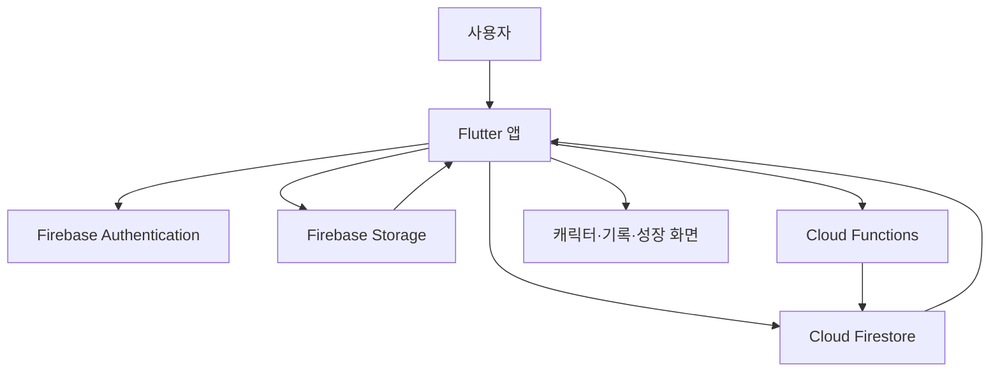
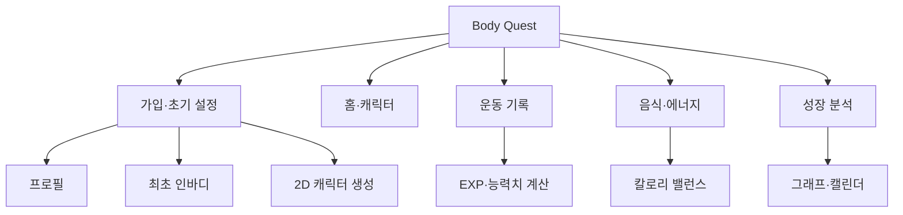

# STEP 1 — 앱 전체 구조

## 이번 단계의 목표

Body Quest를 Flutter와 Firebase로 구현할 때 기능들이 서로 어떻게 연결되는지 확정한다. 이 단계에서는 화면 코드를 작성하지 않는다.

## 확정 기술

| 영역 | 기술 | 역할 |
|---|---|---|
| 모바일 앱 | Flutter / Dart | Android와 iOS 공통 앱 |
| 상태 관리 | Riverpod | 로그인·프로필·기록 상태 관리 |
| 화면 이동 | go_router | 로그인 및 온보딩 경로 제어 |
| 인증 | Firebase Authentication | 이메일 회원가입·로그인 |
| 데이터 | Cloud Firestore | 프로필, 인바디, 운동, 음식, 성장 데이터 |
| 파일 | Firebase Storage | 캐릭터 파츠와 운동 자세 이미지 |
| 서버 계산 | Cloud Functions | EXP, 레벨업, 통계 등 위변조 방지 계산 |
| 분석 | Firebase Analytics | 화면 및 기능 사용 분석 |
| 오류 수집 | Firebase Crashlytics | 앱 오류 확인 |

## 전체 시스템 구조

## 앱 기능 구조

## 가입 후 첫 사용 흐름

1. 앱 실행
2. 로그인 상태 확인
3. 회원가입 또는 로그인
4. 기본 프로필 입력
5. 최초 인바디 입력 또는 건너뛰기
6. 2D 캐릭터 선택 및 조절
7. 초기 능력치와 캐릭터 상태 생성
8. 홈 화면 진입

중간에 앱을 종료해도 `onboardingStep`을 저장해 다음 실행 시 이어서 진행한다.

## 핵심 처리 흐름

### 운동 저장

1. 사용자가 운동과 세트를 입력한다.
2. 앱이 입력값과 총 볼륨을 검사한다.
3. 운동 세션을 Firestore에 저장한다.
4. Cloud Function이 EXP와 부위별 EXP를 계산한다.
5. 일일 획득 한도와 중복 보상을 검사한다.
6. 사용자 레벨과 능력치를 갱신한다.
7. 홈 화면에 성장 결과를 표시한다.

### 음식 저장

1. 음식, 양, 칼로리와 영양소를 입력한다.
2. 식사별 기록을 저장한다.
3. 당일 섭취량을 합산한다.
4. BMR·일상 활동·운동 소비량과 비교한다.
5. 칼로리 밸런스를 보여주되 극단적인 적자를 보상하지 않는다.

### 신체 변화

1. 새 인바디 기록을 저장한다.
2. 단일 측정값이 아니라 최근 추세와 측정 간격을 확인한다.
3. 체지방·근육 변화 점수를 안전 범위로 제한한다.
4. 부위별 운동 성장 데이터와 결합한다.
5. 캐릭터의 단계형 체형 파라미터를 천천히 갱신한다.

## 앱 내부 계층

| 계층 | 책임 |
|---|---|
| Presentation | 화면, 입력 폼, 위젯, 상태 표현 |
| Application | 가입 흐름, 운동 저장, 레벨업 같은 유스케이스 |
| Domain | User, Workout, EXP, Character 규칙과 모델 |
| Data | Firebase 저장소, DTO, 데이터 변환 |
| Core | 테마, 라우팅, 오류, 공통 유틸리티 |

화면에서 Firestore를 직접 호출하지 않는다. 화면은 Provider/Controller를 호출하고, Controller는 Repository를 통해 데이터에 접근한다.

## 권한 원칙

- 사용자는 자신의 개인 기록만 읽고 쓸 수 있다.
- 운동 DB, 레벨표, 퀘스트 정의는 모든 로그인 사용자가 읽을 수 있다.
- EXP, 레벨, 업적 확정값은 Cloud Functions만 수정한다.
- 캐릭터 원본 에셋은 Storage에서 읽고 선택 결과만 사용자 문서에 저장한다.
- 관리자 권한은 Custom Claims로 분리한다.

## 시간과 단위 원칙

- 서버 저장 시간: UTC Timestamp
- 화면 표시 날짜: 사용자 시간대
- 체중과 중량: 내부 저장은 kg
- 키와 신체 둘레: cm
- 거리: km
- 에너지: kcal
- 날짜별 문서 ID: 사용자 시간대 기준 `yyyy-MM-dd`

## MVP 경계

### 이번 MVP에 포함

- 이메일 회원가입·로그인
- 프로필과 선택적 인바디
- 2D 조합형 캐릭터
- 운동 세트 기록과 볼륨
- 음식·칼로리 기록
- EXP·레벨·기본 능력치
- 캐릭터 기본 변화
- 캘린더와 성장 그래프

### 이후 버전

- 퀘스트·업적 고도화
- 장비와 상점
- 친구·랭킹·커뮤니티
- 사진 기반 캐릭터 생성
- AI 코칭
- 웨어러블 자동 연동

## STEP 1 완료 기준

- Flutter + Firebase 사용 확정
- 앱의 주요 기능 경계 확정
- 앱과 서버의 책임 분리
- 가입·운동·음식·성장 처리 흐름 확정
- 건강 데이터와 EXP의 서버 검증 원칙 확정

다음 단계는 **STEP 2 — 전체 화면 구조와 화면별 이동 흐름**이다.
