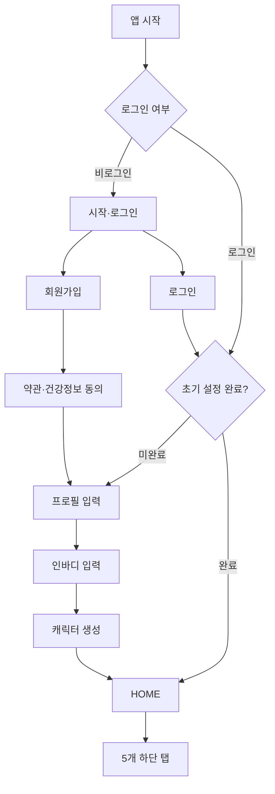

# STEP 2 — 화면 구조와 이동 흐름

## 이번 단계의 목표

MVP에 필요한 화면, 각 화면의 역할, 이동 경로, 빈 상태·오류 상태를 확정한다. 실제 Flutter 화면 코드는 STEP 10부터 작성한다.

## 하단 내비게이션

로그인과 초기 설정을 완료한 사용자에게 다음 5개 탭을 고정으로 제공한다.

| 순서 | 탭 | Flutter 경로 | 핵심 기능 |
|---|---|---|---|
| 1 | HOME | `/home` | 캐릭터, 레벨, EXP, 오늘 상태 |
| 2 | WORKOUT | `/workout` | 운동 선택, 세트 및 유산소 기록 |
| 3 | FOOD | `/food` | 음식과 영양소 기록 |
| 4 | GROWTH | `/growth` | 인바디, 캘린더, 그래프 |
| 5 | MY | `/my` | 프로필, 캐릭터, 설정 |

Flutter의 `StatefulShellRoute.indexedStack`을 사용해 탭을 바꿔도 각 탭의 스크롤과 입력 상태를 유지한다.

## 전체 화면 이동 구조

실제로는 저장된 `onboardingStep`에 따라 프로필, 인바디, 캐릭터 중 정확한 다음 화면으로 이동한다.

## A. 앱 시작 및 인증 화면

### A01. 스플래시

- 경로: `/splash`
- 표시: 로고, 로딩
- 처리: Firebase 초기화, 로그인 확인, 온보딩 진행 상태 확인
- 성공 이동: `/welcome`, 온보딩 화면 또는 `/home`
- 실패: 재시도 버튼과 간단한 오류 안내

### A02. 시작

- 경로: `/welcome`
- 표시: 앱 핵심 문구, 캐릭터 대표 이미지
- 버튼: 회원가입, 로그인
- 문구: “게임 캐릭터가 아니라 현실의 나를 레벨업하세요.”

### A03. 회원가입

- 경로: `/auth/sign-up`
- 입력: 이메일, 비밀번호, 비밀번호 확인
- 검증: 이메일 형식, 비밀번호 8자 이상, 일치 여부
- 성공: 동의 화면
- 오류: 이미 가입된 이메일, 약한 비밀번호, 네트워크 오류를 한국어로 표시

### A04. 로그인

- 경로: `/auth/sign-in`
- 입력: 이메일, 비밀번호
- 버튼: 로그인, 비밀번호 찾기
- 성공: 온보딩 상태에 따라 다음 화면 결정

### A05. 비밀번호 재설정

- 경로: `/auth/reset-password`
- 입력: 이메일
- 성공: 재설정 메일 발송 안내

### A06. 동의

- 경로: `/onboarding/consent`
- 항목: 이용약관, 개인정보 처리, 건강 데이터 수집
- 필수·선택을 분리하고 문서 버전과 동의 시각 저장
- 필수 동의 전에는 다음 버튼 비활성화

## B. 초기 설정 화면

상단에 `1/3`, `2/3`, `3/3` 진행 표시를 제공한다.

### B01. 프로필 입력

- 경로: `/onboarding/profile`
- 필수: 닉네임, 성별, 생년월일, 키, 체중, 운동 경험, 운동 목적, 목표, 주당 운동 목표
- 나이: 생년월일로 자동 계산하며 별도 저장하지 않음
- 운동 목적: 복수 선택
- 저장 후: 인바디 입력으로 이동

### B02. 최초 인바디 입력

- 경로: `/onboarding/inbody`
- 필수: 측정일, 체중
- 선택: 골격근량, 체지방량, 체지방률, BMI, BMR, 내장지방, 체수분, 단백질, 무기질
- 기능: 선택 항목은 비워 둘 수 있고 화면 전체를 건너뛸 수도 있음
- 안내: 측정 기기와 조건에 따라 차이가 날 수 있음
- 저장/건너뛰기 후: 캐릭터 생성

### B03. 최초 캐릭터 생성

- 경로: `/onboarding/character`
- 중앙: 레이어를 합성한 2D 캐릭터 미리보기
- 선택: 얼굴, 머리, 피부톤, 기본 체형, 운동복
- 기능: 이전/다음, 무작위 조합, 초기화, 생성 완료
- 완료: 캐릭터·초기 능력치 생성 후 홈 이동

## C. HOME 탭

### C01. 홈 대시보드

- 경로: `/home`
- 상단: 닉네임, LV, EXP 바, 알림
- 중앙: 가장 크게 표시되는 캐릭터
- 능력치: STR, END, CARDIO, BODY, CONSISTENCY
- 하단: 오늘 운동, 섭취, 소비, 에너지 밸런스
- 오늘의 퀘스트는 MVP에서는 요약 카드만 표시하고 본격 보상은 후속 버전
- 빠른 버튼: 운동 시작, 음식 추가, 신체 기록

### C02. EXP 결과 모달

- 별도 경로 대신 운동 저장 직후 Bottom Sheet
- 표시: 획득 EXP, 레벨 변화, 부위별 EXP, 개인 기록
- 레벨업 시 짧은 연출 제공
- 모션 감소 설정 사용자는 정적 화면 제공

### C03. 오늘 상세

- 경로: `/home/today`
- 운동·음식·소비 칼로리의 시간순 기록
- 기록 수정 및 삭제 진입

## D. WORKOUT 탭

### D01. 운동 홈

- 경로: `/workout`
- 최근 운동, 자주 한 운동, 부위 선택, 유산소 선택
- 버튼: 새 운동 시작

### D02. 운동 부위 선택

- 경로: `/workout/body-part`
- 가슴, 등, 어깨, 팔, 하체, 복근, 전신, 유산소

### D03. 운동 검색·선택

- 경로: `/workout/exercises`
- 검색, 부위·기구·난이도 필터
- 운동 카드: 자세 이미지, 한글명, 주요 근육
- 선택한 운동을 현재 세션에 추가

### D04. 운동 설명

- 경로: `/workout/exercises/:exerciseId`
- 이미지, 설명, 주요·보조 근육, 주의 사항
- 버튼: 운동에 추가

### D05. 근력운동 세션

- 경로: `/workout/session/:sessionId`
- 운동별 세트, 중량, 횟수, 휴식 타이머, 메모
- 자동 계산: 세트 볼륨과 세션 총 볼륨
- 기능: 세트 복사, 추가, 삭제, 운동 순서 변경
- 완료 전 임시 저장으로 앱 종료 시 복구

### D06. 유산소 기록

- 경로: `/workout/cardio/:sessionId`
- 유형, 시간, 거리, 평균 속도, 평균 심박수, 소모 칼로리
- 사용자가 직접 입력한 칼로리인지 계산값인지 구분

### D07. 운동 완료 확인

- 경로: `/workout/session/:sessionId/complete`
- 시간, 볼륨, 운동 수, 예상 소비량 검토
- 완료 버튼을 누른 뒤 서버가 EXP 계산
- 성공 후 EXP 결과 모달과 홈/운동기록 이동

### D08. 운동 기록 상세

- 경로: `/workout/history/:sessionId`
- 과거 운동 전체 내용
- 수정 시 EXP를 재계산하고 변경 이력을 남김

## E. FOOD 탭

### E01. 음식 홈

- 경로: `/food`
- 아침, 점심, 저녁, 간식별 목록
- 당일 칼로리와 탄수화물·단백질·지방 합계
- 버튼: 음식 추가

### E02. 음식 직접 입력

- 경로: `/food/add`
- 식사 구분, 음식명, 섭취량, 단위, kcal
- 선택: 탄수화물, 단백질, 지방, 식이섬유
- 자주 먹는 음식으로 저장 가능

### E03. 음식 수정

- 경로: `/food/entries/:entryId/edit`
- 기존 값을 불러오고 수정·삭제
- 저장 후 일일 합계 즉시 재계산

### E04. 하루 에너지 상세

- 경로: `/food/energy`
- BMR, 일상 활동, 운동, 총소비, 섭취, 밸런스
- 모든 소비량은 추정값으로 표시
- 과도한 적자를 EXP 보상으로 연결하지 않음

## F. GROWTH 탭

### F01. 성장 홈

- 경로: `/growth`
- 최근 신체 변화, 레벨 변화, 주요 그래프 미리보기
- 기간: 7일, 30일, 3개월, 전체

### F02. 운동 캘린더

- 경로: `/growth/calendar`
- 웨이트, 유산소, 휴식, 인바디를 아이콘과 색상으로 함께 구분
- 날짜 선택 시 해당 날짜 기록 표시

### F03. 인바디 목록

- 경로: `/growth/inbody`
- 측정일순 목록과 직전 대비 변화량
- 버튼: 새 인바디 추가

### F04. 인바디 추가·수정

- 경로: `/growth/inbody/new`, `/growth/inbody/:recordId/edit`
- 초기 인바디와 같은 필드
- 비현실적인 범위 입력 시 저장 전 확인

### F05. 성장 그래프 상세

- 경로: `/growth/charts/:metric`
- 체중, 골격근량, 체지방률, 운동량, 시간, 섭취·소비, 레벨
- 데이터가 부족할 때 빈 그래프 대신 안내 표시

### F06. 성장 리포트

- 경로: `/growth/reports/:period`
- 주간·월간 운동, 영양, 신체, 레벨 요약
- MVP에서는 앱 내부 보기까지만 포함

## G. MY 탭

### G01. MY 홈

- 경로: `/my`
- 프로필, 캐릭터, 능력치, 설정 메뉴

### G02. 프로필 확인·수정

- 경로: `/my/profile`
- 닉네임, 목표, 키, 활동 수준, 운동 목표 수정
- 생년월일 등 민감 정보 변경 시 확인 표시

### G03. 캐릭터 편집

- 경로: `/my/character`
- 해금된 기본 파츠 안에서 외형 변경
- 체형 성장값은 사용자가 직접 임의 조작할 수 없음

### G04. 능력치 상세

- 경로: `/my/stats`
- 전체·부위별 EXP와 상승 근거
- CHEST, BACK, SHOULDER, ARM, LEG, CORE, CARDIO

### G05. 설정

- 경로: `/my/settings`
- 알림, 모션 감소, 단위, 개인정보, 로그아웃

### G06. 계정 및 데이터 관리

- 경로: `/my/settings/account`
- 데이터 내보내기, 계정 삭제
- 삭제는 재인증과 최종 확인 필요

## 공통 상태 설계

모든 데이터를 읽는 화면은 다음 상태를 가진다.

1. 로딩: 스켈레톤 또는 진행 표시
2. 정상: 데이터 표시
3. 빈 상태: 첫 행동을 알려주는 버튼
4. 오류: 원인 요약과 재시도
5. 오프라인: 저장 대기 여부와 마지막 동기화 시각
6. 권한 없음: 재로그인 또는 접근 불가 안내

입력 화면은 중복 저장 방지, 저장 중 버튼 비활성화, 실패 시 입력 유지가 필수다.

## 내비게이션 보호 규칙

| 사용자 상태 | 허용 경로 | 자동 이동 |
|---|---|---|
| 비로그인 | 시작·인증 | 보호 화면 접근 시 `/welcome` |
| 로그인·동의 미완료 | 동의 | 다른 화면 접근 시 `/onboarding/consent` |
| 프로필 미완료 | 프로필 | `/onboarding/profile` |
| 인바디 단계 | 인바디 | `/onboarding/inbody` |
| 캐릭터 미완료 | 캐릭터 | `/onboarding/character` |
| 초기 설정 완료 | 전체 MVP | 인증 화면 접근 시 `/home` |

## 실제 구현 묶음

화면 수가 많으므로 한 번에 만들지 않고 다음 묶음으로 구현한다.

1. 앱 시작, 시작, 회원가입, 로그인
2. 동의, 프로필, 인바디, 캐릭터 생성
3. 5개 하단 탭과 홈 기본 화면
4. 근력운동과 유산소 기록
5. 음식과 에너지 밸런스
6. 성장 캘린더, 인바디, 그래프
7. 프로필, 캐릭터, 능력치, 설정

각 묶음이 끝날 때 앱을 실행해 이동, 저장, 오류 상태를 테스트한다.

## STEP 2 완료 기준

- 하단 메뉴 5개 확정
- 인증·초기 설정·메인 화면 경로 확정
- MVP 화면 36개와 역할 확정
- 로그인 및 온보딩 경로 보호 규칙 확정
- 구현 묶음과 테스트 지점 확정

다음 단계는 **STEP 3 — Firebase 컬렉션, 문서, 필드와 보안 구조 설계**다.
